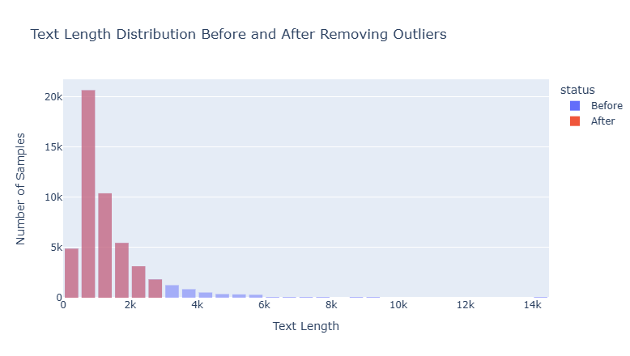
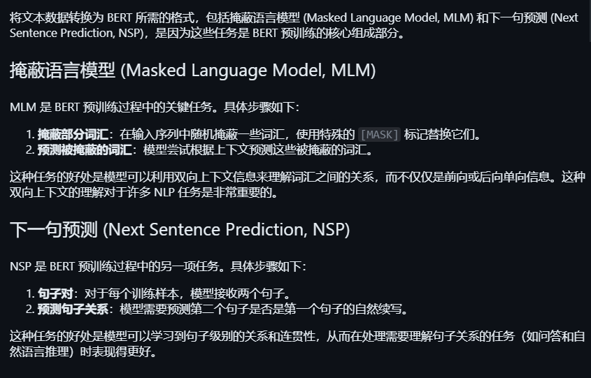

# 📚 NLP Tutorial: How to be Shakespeare? 🌟


# 2024/08/09 Update README

This update introduces a method for using unsupervised pretraining on unlabelled data before fine-tuning the model on a supervised task. The experiment shows that unsupervised pretraining significantly enhances the model's performance compared to a baseline model without such pretraining. 🎉

## 📂 Repository Structure

```plaintext
NLP-Tutorial-How-to-be-Shakesapeare/
├── Are-You-Mad?/
│   ├── are-you-mad.ipynb
│   └── predictions.csv
├── Shakes-a-Peare/
│   └── shakesapear.ipynb
└── Leave-Me-Alone/
    ├── get_data.ipynb
    ├── pretrain_with_unsupervised_data.ipynb
    └── train.ipynb
```


## 🆕 2024/08/09 Update: Unsupervised Pretraining for Enhanced Performance 🚀

### Overview

In this update, we explore the process of unsupervised pretraining using unlabelled data, followed by fine-tuning the model on a labelled dataset. The goal is to demonstrate how pretraining on unlabelled data can improve model performance in supervised tasks.

### Workflow

1. **Step 1: Data Preparation**: 
   - Fetch and prepare datasets, including the unsupervised data; then apply simple preprocess.
   
   - 📝 **Notebook**: [get_data.ipynb](Leave-Me-Alone/get_data.ipynb)

2. **Step 2: Unsupervised Pretraining**: 
   - Pretrain a BERT model on unlabelled data using tasks like Masked Language Modeling (MLM) and Next Sentence Prediction (NSP).
   
   - 📝 **Notebook**: [pretrain_with_unsupervised_data.ipynb](Leave-Me-Alone/pretrain_with_unsupervised_data.ipynb)

3. **Step 3: Supervised Training**: 
   - Fine-tune the pretrained model on a small subset of the IMDb dataset (5000 samples) for sentiment classification.
   - Compare the performance with a baseline model trained without unsupervised pretraining.
   - 📝 **Notebook**: [train.ipynb](Leave-Me-Alone/train.ipynb)


### Results

After training, the model pretrained with unsupervised data showed better performance compared to the baseline model trained from scratch:

- **Accuracy**: Higher accuracy on the test dataset.
- **F1 Score**: Improved F1 score, indicating better precision and recall.
- **Conclusion**: Unsupervised pretraining provides a substantial performance boost, especially when the labelled dataset is limited.


## 🔥 Are-You-Mad?

**Are-You-Mad?** is a project where we harness the power of **BERT (bert-chinese)** for sentiment classification. In this notebook, we dive into the nuances of understanding emotions in text, using BERT to predict whether the sentiment is positive or negative. 😊😠

### Highlights:
- **Data Preprocessing**: Cleaning and preparing text data. 🧹
- **Model Training**: Fine-tuning the BERT model for sentiment classification. 🧠
- **Evaluation**: Assessing the model's performance with various metrics. 📊
- **Predictions**: Generating predictions and saving them to `predictions.csv`. 📈

### Results:
- **Accuracy**: 0.93996
- **F1 Score**: 0.9399599576357461
- **Recall**: 0.93996

Confusion Matrix:
```
[[11739   761]
 [  740 11760]]
```

📝 **Notebook**: [are-you-mad.ipynb](Are-You-Mad?/are-you-mad.ipynb)

📊 **Predictions**: [predictions.csv](Are-You-Mad?/predictions.csv)

## ✍️ Shakes-a-Peare

**Shakes-a-Peare** is our attempt to step into the shoes of the great playwright, Shakespeare, by using an **LSTM** (Long Short-Term Memory) network for text prediction. In this notebook, we focus on generating text that mimics Shakespearean style, showing the power of recurrent neural networks in handling sequential data. ✒️📜

### Highlights:
- **Data Preparation**: Tokenizing and preparing text sequences. 📝
- **Model Training**: Building and training an LSTM model for text generation. 🧠
- **Text Generation**: Using the trained model to generate Shakespearean text. 🖋️

📜 **Notebook**: [shakesapear.ipynb](Shakes-a-Peare/shakesapear.ipynb)

## 🌟 How to Use This Repo

1. **Clone the repository**:
    ```bash
    git clone https://github.com/yourusername/NLP-Tutorial-How-to-be-Shakesapeare.git
    ```

2. **Navigate to the project directory**:
    ```bash
    cd NLP-Tutorial-How-to-be-Shakesapeare
    ```

3. **Run the notebooks**:
    Open the Jupyter notebooks in your favorite editor (e.g., Jupyter Lab, VS Code) and run them step-by-step. 🚀

## 📢 Contributing

We welcome contributions! If you have ideas for improving the project or adding new features, feel free to fork the repository and submit a pull request. Let's make this project even better together! 🤝

## 📬 Contact

If you have any questions, feel free to open an issue or reach out to me at [3208010014@i.smu.edu.cn](mailto:3208010014@i.smu.edu.cn). 📧

Enjoy exploring NLP and have fun becoming the next Shakespeare! 🎭✨

---

Made with ❤️ by David Jam